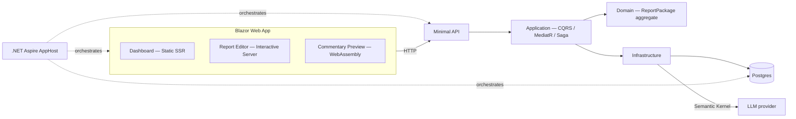

# Client Report Portal

An internal tool a client-service team at an asset manager would use to assemble, review, and publish each client's quarterly report — commentary, performance, and holdings — with AI-assisted drafting and full observability across the stack.

Built as a hands-on exercise across a deliberate set of modern .NET patterns; each one is a real requirement of the app, not a demo bolted on for its own sake. See [`docs/decisions/`](docs/decisions/) for the reasoning behind each decision.

## What this demonstrates

- **Domain-Driven Design** — a `ReportPackage` aggregate enforcing real invariants (e.g. can't publish until every section is approved)
- **CQRS via MediatR** — commands and queries kept separate end to end
- **Saga pattern** — an orchestrated, compensating multi-step compile pipeline (MassTransit saga state machine)
- **Semantic Kernel** — AI-drafted report commentary via a single-purpose SK plugin, called directly from `Infrastructure` behind an `ICommentaryDraftingService` abstraction
- **.NET Aspire** — local orchestration of Postgres, the API, and the web app, with a shared telemetry dashboard
- **OpenTelemetry** — traces spanning Blazor → API → the Semantic Kernel call for every AI-assisted action
- **Blazor Web App render modes** — Static SSR, Interactive Server, and WebAssembly used deliberately per page, not by default
- **Minimal APIs** — a thin HTTP layer translating to/from MediatR

## Related work

Model Context Protocol is demonstrated separately, in [`dotnet-dev-tools-mcp`](../dotnet-dev-tools-mcp) — a standalone code-review tool exposed to a real MCP host (Claude Code / Claude Desktop). It's deliberately not wired into this app: MCP is for a host that discovers and chooses tools dynamically, and this portal always wants exactly one known thing (drafted commentary), so it calls Semantic Kernel directly instead. See `docs/decisions/` for the full reasoning.

## Architecture



## Project structure
src/
  ClientReportPortal.AppHost/          Aspire orchestration
  ClientReportPortal.ServiceDefaults/  shared OTel + health checks
  ClientReportPortal.Domain/           aggregates, invariants — zero deps
  ClientReportPortal.Application/      CQRS + saga
  ClientReportPortal.Infrastructure/   EF Core, Semantic Kernel integration
  ClientReportPortal.Api/              minimal API endpoints
  ClientReportPortal.Web/              Blazor (server + WASM client)
tests/
  ClientReportPortal.Domain.Tests/
docs/
  adr/                                 architecture decision records


## Getting started
Prerequisites: .NET 10 SDK, Docker Desktop running (for the Postgres container), the [Aspire CLI](https://get.aspire.dev) installed and on PATH.

```bash
dotnet run --project src/ClientReportPortal.AppHost
```

Opens the Aspire dashboard, from which you can reach the Blazor app and inspect traces/logs/metrics across every service.

## Status
Early scaffolding — see [`docs/decisions/`](docs/decisions/) for what's decided and what's still open.

